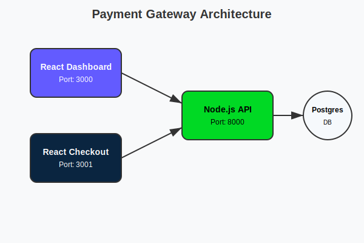

# Payment Gateway Project (Week 6)

## Project Overview
This is a full-stack payment gateway simulation built with Docker. It allows merchants to generate payment links, simulates customer checkout using UPI/Cards, and provides a dashboard to view transaction analytics.

## Tech Stack
- **Frontend:** React.js (Dashboard & Checkout Page)
- **Backend:** Node.js (Express)
- **Database:** PostgreSQL 15
- **Containerization:** Docker & Docker Compose

## Prerequisites
- Docker Desktop installed and running.

## Setup Instructions
1. **Start the Application:**
   Open a terminal in the project root and run:
   ```bash
   docker-compose up -d --build
   ```

2. **Access the Services:**
   - **Dashboard:** http://localhost:3000
   - **Checkout Page:** http://localhost:3001
   - **API:** http://localhost:8000/health

3. **Login Credentials:**
   - **Email:** test@example.com
   - **Password:** (Any password is accepted for this demo)

## How to Test (Happy Path)
1. **Login:** Go to the Dashboard and log in with the email above.
2. **Create Order:** Use the "Payment Terminal" on the dashboard. Enter an amount (e.g., 500) and click "Create Payment Link".
3. **Pay:** Click "Pay Now" to go to the Checkout Page.
   - Select **Card**.
   - **Card Number:** 4242 4242 4242 4242
   - **Expiry:** 12/30
   - **CVV:** 123
   - **Name:** Test User
4. **Verify:** Wait for the "Success" screen, then click "Return to Merchant". You will see the transaction listed in the Dashboard.

## Architecture
The system consists of 4 Docker containers:
1. **pg_gateway:** PostgreSQL database storing merchants and orders.
2. **gateway_api:** Node.js backend handling business logic.
3. **gateway_dashboard:** React Admin UI for merchants.
4. **gateway_checkout:** React hosted payment page for customers.


